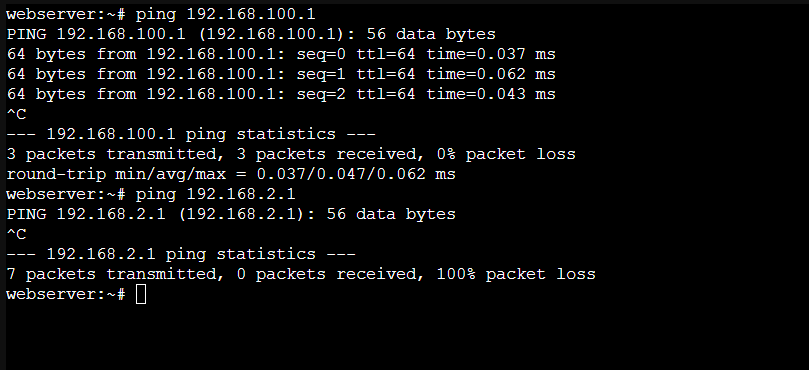

Proxmox Networking Setup
========================

Overview
--------
This guide will assist you in setting up NAT to segregate your machines/containers on Proxmox. It covers the configuration of a new Linux bridge network, enabling NAT, configuring DHCP, and connecting clients to the NAT.

Network Topology
----------------
- **Physical Network**: One network card attached to the server (built-in) and connected directly to home router.
- **Proxmox Server**: The server hosts a running DNS server and a WireGuard VPN server. A new web-facing server for a personal website will be created and placed in the new NAT to segregate it from the rest of the network.

Steps for Creating a New NAT on Proxmox
----------------------------------------
#. Navigate to the network section under the Proxmox server.

#. Create a new Linux bridge.

#. Assign a name an IP address, and CIDR to the network (e.g., "192.168.100.1/24", "vmbr1") .

#. Access the Proxmox console.

#. Open the ``/etc/network/interfaces`` file (``nano /etc/network/interfaces``).

#. Add the following configuration:

      auto vmbr1
      iface vmbr1 inet static
          address 192.168.100.1
          netmask 255.255.255.0
          bridge-ports none
          bridge-stp off
          bridge-fd 0

#. Exit the editor.

#. Allow IPv4 forwarding: ``sysctl -w net.ipv4.ip_forward=1``.

#. Reload sysctl settings: `` sysctl -p``.

#. Add NAT rules(192.168.2.0/24 is the vmbr0 network):

      iptables -t nat -A POSTROUTING -s 192.168.100.0/24 -o vmbr0 -j MASQUERADE
      iptables -A FORWARD -s 192.168.100.0/24 -d 192.168.2.0/24 -j DROP
      

#. Make config presistent

       apt-get update
       apt-get install iptables-persistent

      iptables-save > /etc/iptables/rules.v4
      ip6tables-save > /etc/iptables/rules.v6

#. Check the rules: `` iptables -t nat -L`` - you should be able to see the new rules.

Configuring DHCP for the NAT
-----------------------------
#. Install ISC DHCP server:

       apt-get update
       apt-get install isc-dhcp-server

    

#. Edit the DHCP server configuration file:

      nano /etc/dhcp/dhcpd.conf

#. Add the following configuration:

      subnet 192.168.100.0 netmask 255.255.255.0 {
          range 192.168.100.100 192.168.100.200;
          option routers 192.168.100.1;
          option domain-name-servers <dns-server-ip>;
      }

#. Start and enable the DHCP service:
    
     systemctl start isc-dhcp-server
     systemctl enable isc-dhcp-server
    

Adding Clients to the NAT
-------------------------
#. Navigate to the server you want to add to the NAT.

#. Open the network tab and select the new network (``vmbr1``).

#. Enable DHCP and check connectivity.

Test connectivity
-------------------------

Troubleshooting
---------------
- Common issues that you might encounter include IP leasing or no internet connectivity.
- Review the steps outlined above to troubleshoot and resolve any issues.
